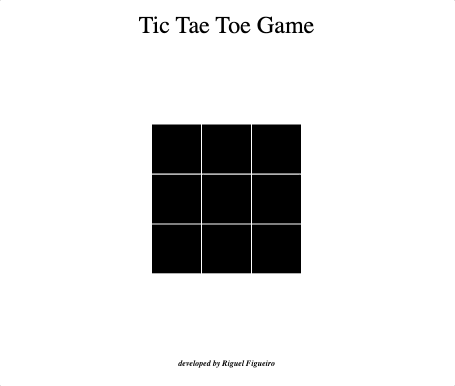

# Tic Tac Toe - Game

## About The Project
### This project is an implementation of the classic game Tic Tac Toe with Javascript

### Built With

* Javascript Vanilla
* HTML 5
* Css

## Usage

Just open the index.html file in your preferred browser

## Roadmap

- [ ] Add a leaderboard
- [ ] Separate all functions on distinct files (SRP pattern)

## License

Distributed under the MIT License. See `LICENSE` for more information.

### Developed by Riguel Figueiró